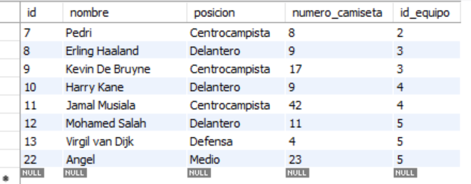
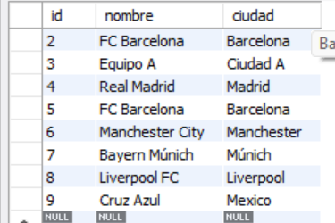
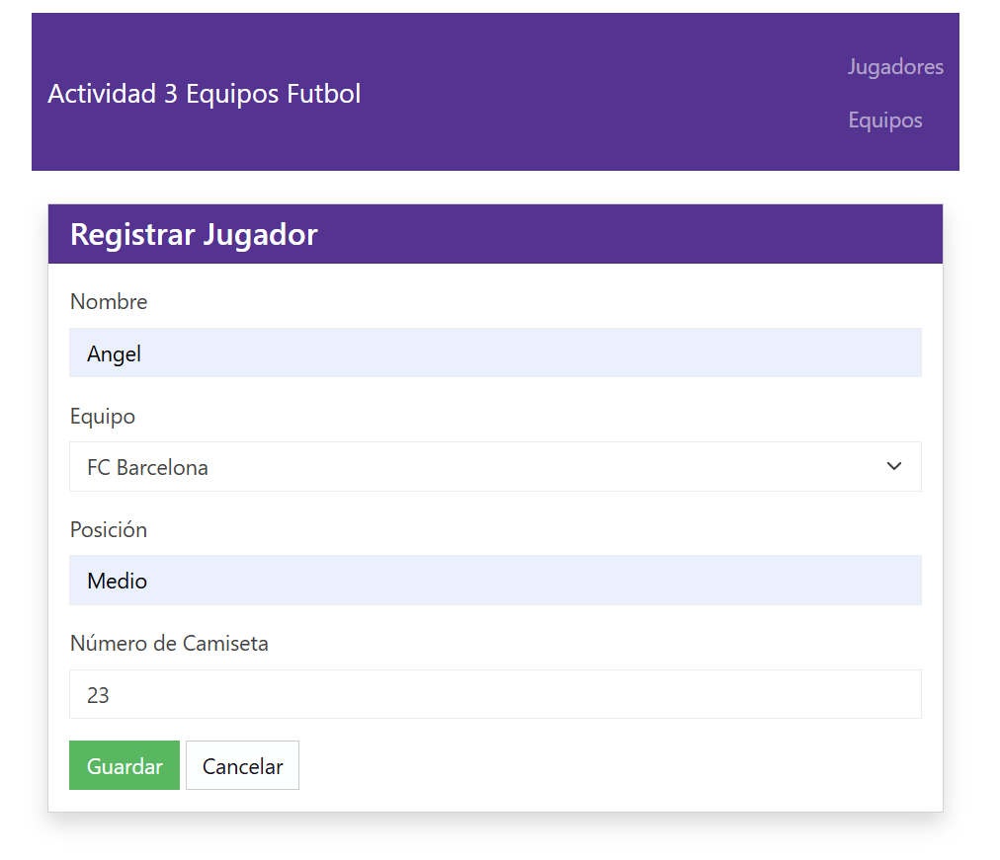
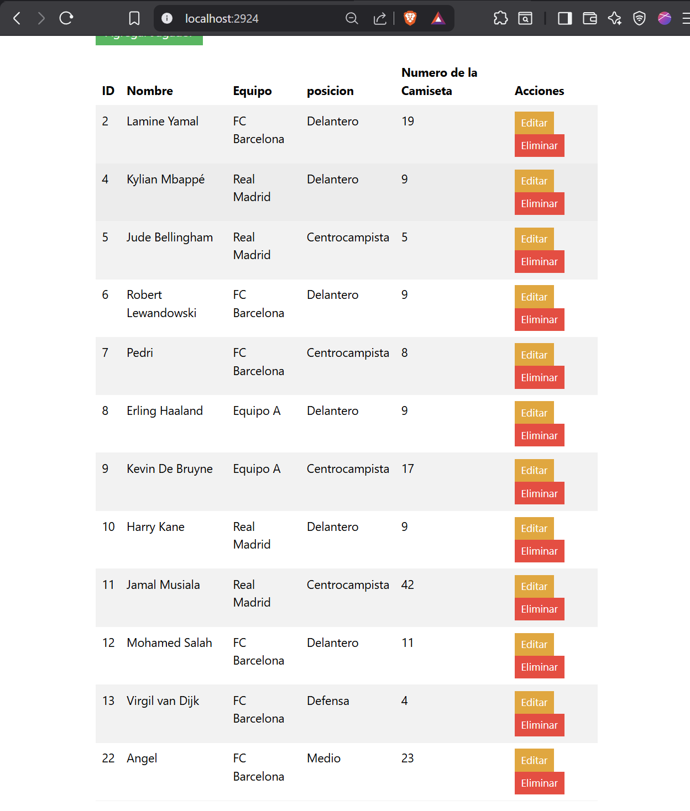
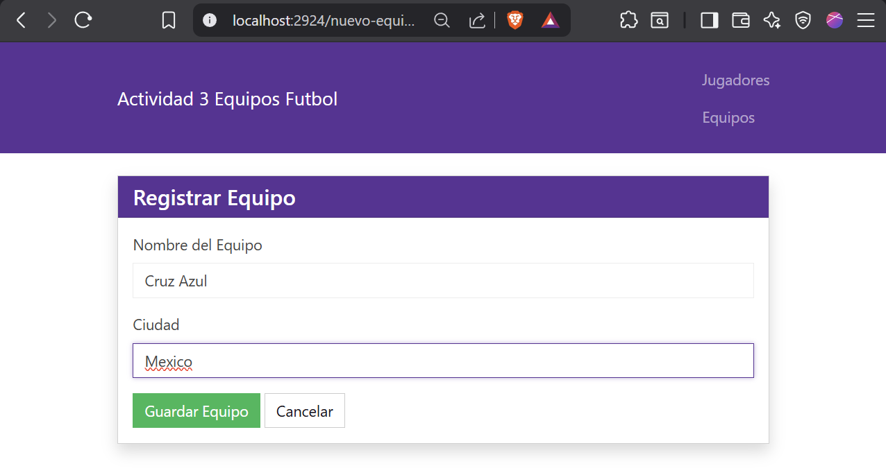
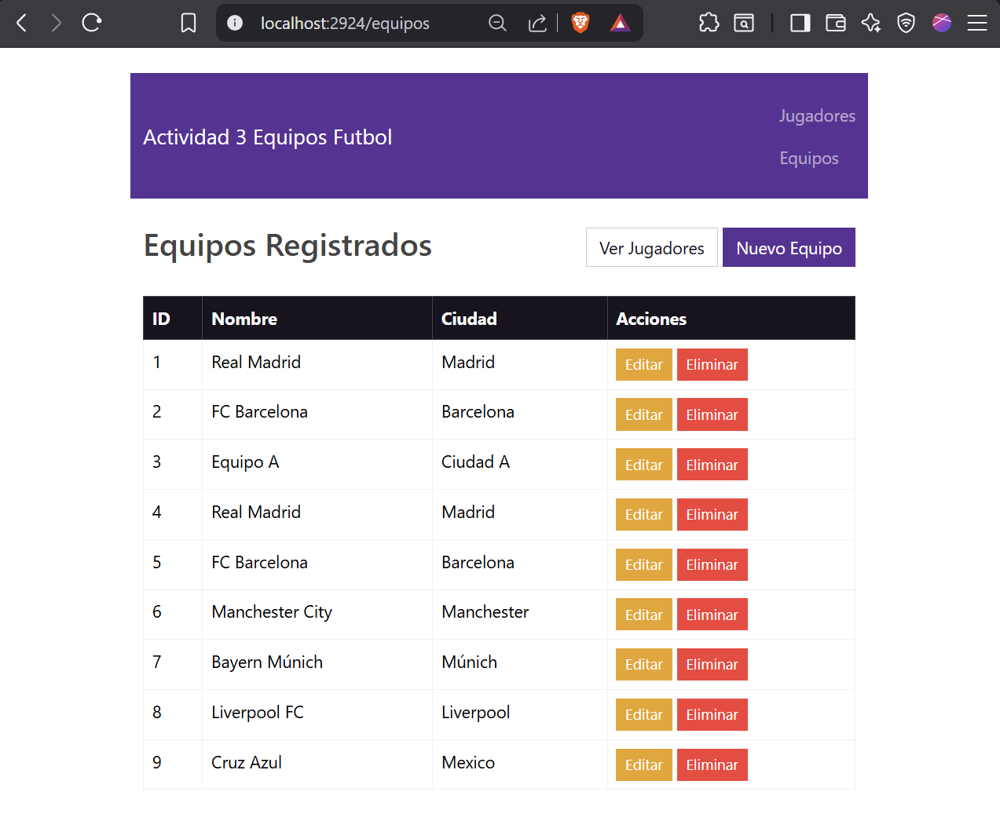
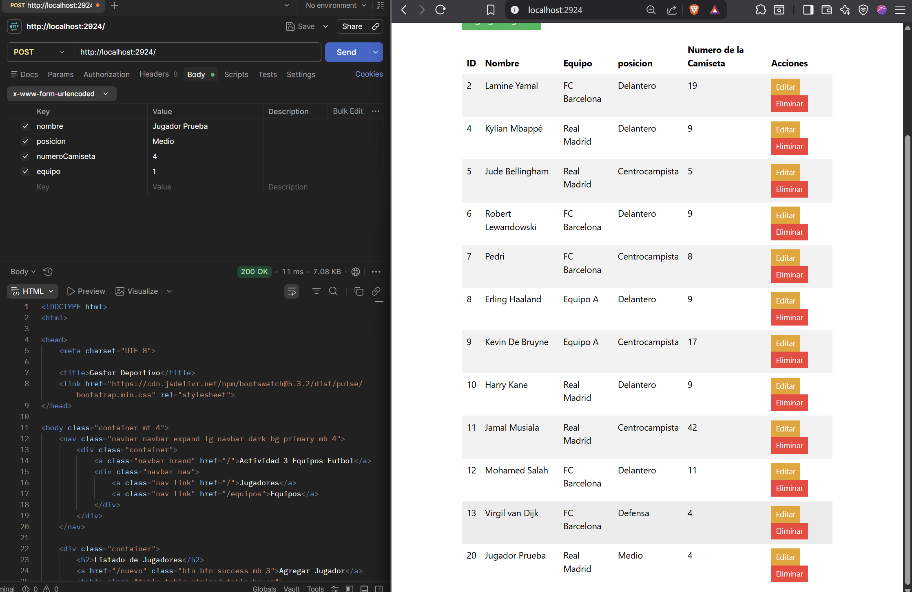
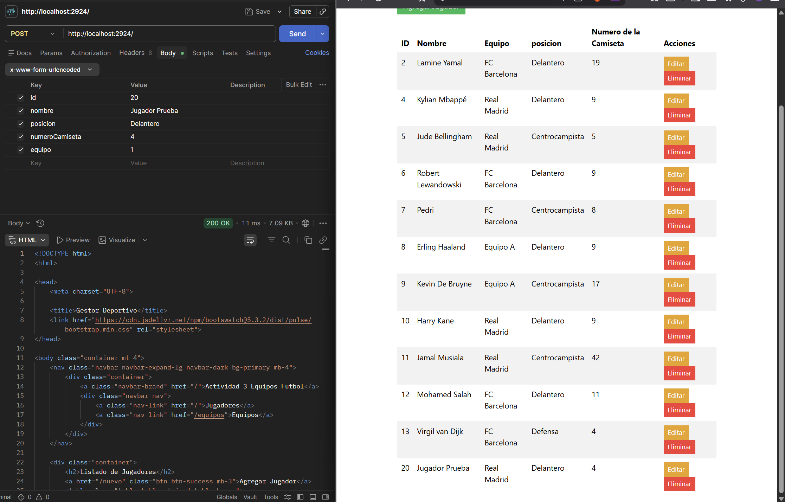
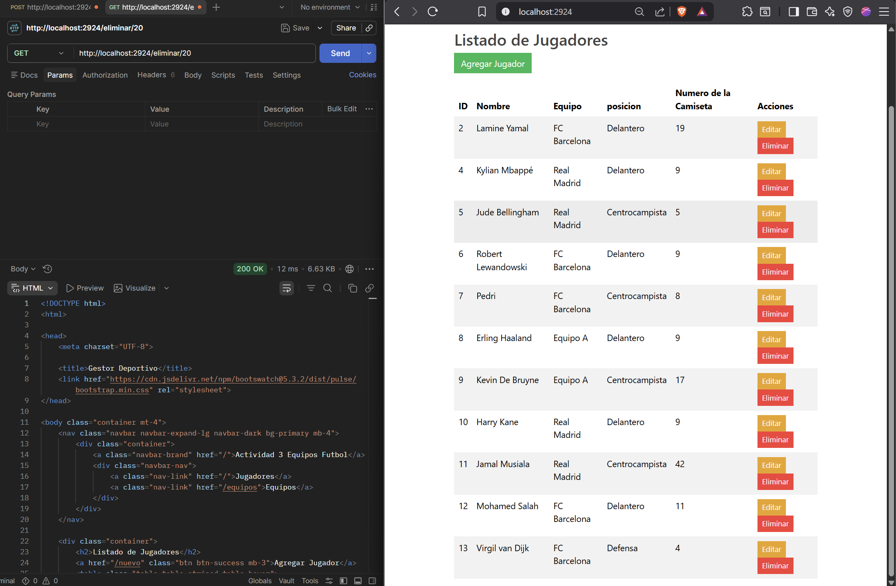

# Actividad 3 CRUD en Spring Boot y Relaciones

## Instituto Tecnologico de Oaxaca

**Alumno:** Mendez Garcia Angel de Jesus

**Profesora:** Martinez Nieto Adelina

**Materia:** Verano de Programacion WEB

---

## Descripcion de la Actividad

En esta actividad se desarrollo mi primera aplicacion web backend conectada a una base de datos utilizando el framework Java Spring Boot. El objetivo principal de la actividad fue implementar un sistema de gestion deportiva capaz de realizar las cuatro operaciones basicas de persistencia de datos (Crear, Leer, Actualizar y Eliminar), conocido como CRUD. 

---

## Explicacion de Metodos y Herramientas

Para que el proyecto funcionara correctamente, tuve que aprender a estructurar el codigo en diferentes capas y utilizar varias herramientas nuevas de Spring Boot:

1.  **Anotaciones de Entidad (JPA):** En mis clases modelo, aprendi a usar `@Entity` para decirle al programa que esa clase es una tabla en la base de datos. Para la relacion, use `@ManyToOne` en la clase Jugador y `@OneToMany` en la clase Equipo.
2.  **Repositorios:** En lugar de escribir sentencias SQL manuales, utilice interfaces que heredan de `JpaRepository`. Esto me facilito muchisimo el trabajo porque metodos como `save()`, `findAll()` o `deleteById()` ya vienen programados por defecto.
3.  **Controladores (Controllers):** Aprendi a usar las anotaciones de mapeo para controlar que pagina web o accion responde a cada URL:
    *   `@GetMapping`: Lo utilice para las peticiones de lectura. Por ejemplo, para mostrar los formularios HTML o para recibir un ID por la URL cuando quiero eliminar a un jugador.
    *   `@PostMapping`: Lo aplique exclusivamente para atrapar los datos enviados desde los formularios de Thymeleaf de manera oculta y enviarlos a la base de datos para guardarlos.
4.  **Thymeleaf (Vistas):** Tuve que aprender a modificar el HTML normal. Me di cuenta de que usar `href` tradicional causaba problemas de rutas en el servidor, asi que aprendi a usar el atributo `th:href="@{/ruta}"` para navegar entre paginas y `th:object` junto con `th:field` para conectar las cajas de texto del formulario directamente con mis variables de Java.

---

## Capturas de Pantalla (Evidencias)

A continuacion presento las pruebas de funcionamiento de mi sistema, mostrando tanto la estructura de la base de datos como las operaciones desde la interfaz web y pruebas de backend con Postman.

### 1. Relacion en Base de Datos
Aqui demuestro que las tablas fueron generadas correctamente por Hibernate y que la llave foranea conecta correctamente al jugador con su equipo correspondiente.

**Tabla Equipos:**

**Tabla Jugadores:**

### 2. Operacion CREATE (Crear y Leer)
Pruebas de la insercion de nuevos registros al sistema desde la vista web y confirmacion de que aparecen en la lista, ademas de una prueba cruda enviando los datos por peticion POST.

**Agregar Nuevo Jugador (Formulario):**

**Jugador Agregado Exitosamente (Lista):**

**Agregar Nuevo Equipo (Formulario):**

**Equipo Agregado Exitosamente (Lista):**

**Prueba de Insercion de Datos (Backend):**

### 3. Operacion UPDATE (Actualizar)
Prueba modificando un registro existente enviando la informacion actualizada al mismo ID.

**Prueba de Actualizacion de Datos:**

### 4. Operacion DELETE (Eliminar)
Prueba simulando la peticion al controlador para remover un registro especifico de la base de datos de manera definitiva.

**Prueba de Eliminacion de Datos:**

## Links de la actividad
**Vista Jugadores**
[http://68.183.115.226:2924/MGAJact3_t4/](http://68.183.115.226:2924/MGAJact3_t4/)

**Vista Equipos**
[http://68.183.115.226:2924/MGAJact3_t4/equipos](http://68.183.115.226:2924/MGAJact3_t4/equipos)
